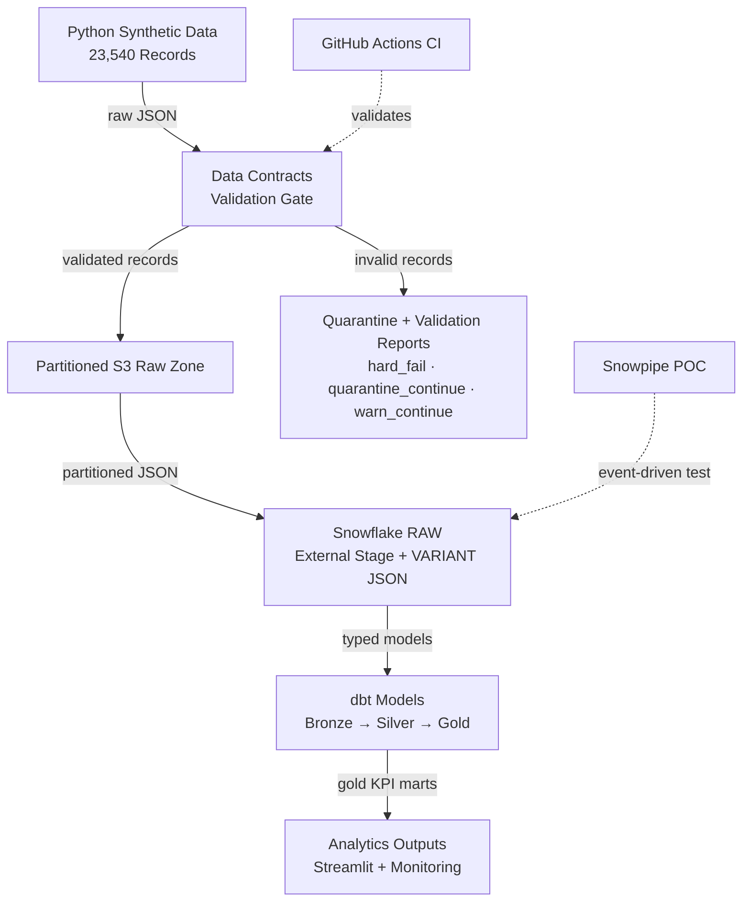

# Fraud & Dispute Analytics Pipeline

## TL;DR

End-to-end fintech data engineering project that simulates fraud, dispute, and chargeback analytics across **23,540 synthetic records**.  
Built with **Python, AWS S3, Snowflake, dbt, Airflow, GitHub Actions, and Streamlit**.  
Includes **data contracts, quarantine handling, audit logs, dbt tests, monitoring, Snowpipe POC, and safe dry-run controls** for external systems.

> This is a production-style portfolio project using fully synthetic data. It does not contain company data, customer data, credentials, or secrets.

---

## Project Highlights

- Generated **23,540 synthetic fintech records** across customers, transactions, fraud signals, disputes, and chargeback outcomes.
- Designed an **S3-style partitioned raw zone** by dataset, year, and month.
- Loaded semi-structured JSON into **Snowflake RAW tables** using external stage patterns.
- Built **dbt bronze, silver, and gold models** for fraud, dispute, chargeback, and monitoring use cases.
- Created business-ready marts for fraud KPIs, dispute trends, chargeback win/loss rates, and resolution timing.
- Implemented **26 dbt data tests across 12 models** with a successful build result of `PASS=38, WARN=0, ERROR=0`.
- Added **versioned JSON Schema data contracts** before ingestion.
- Designed severity-based failure handling with:
  - `hard_fail`
  - `quarantine_continue`
  - `warn_continue`
- Added validation reports, quarantine outputs, validation audit logs, and full pipeline run audit logs.
- Added an **Airflow DAG** to represent production-style orchestration.
- Added **GitHub Actions CI** for safe automated checks.
- Added a **Snowpipe auto-ingest proof of concept** for event-driven ingestion.

---

## Business Problem

A fintech company needs reliable analytics to monitor fraud risk, dispute volume, chargeback outcomes, win/loss rates, average resolution time, and pipeline health across card networks.

This project simulates that workflow by creating trusted reporting tables for:

- Fraud risk by card network
- Daily fraud KPIs
- Dispute and chargeback outcomes
- Chargeback win/loss rates
- Average dispute resolution time
- Pipeline row-count monitoring

---

## Tech Stack

| Category | Tools |
|---|---|
| Language | Python, SQL |
| Cloud Storage | AWS S3 |
| Data Warehouse | Snowflake |
| Ingestion | S3 batch loading, Snowpipe auto-ingest POC |
| Transformation | dbt |
| Orchestration | Airflow DAG, local pipeline runner |
| CI/CD | GitHub Actions |
| Dashboard | Streamlit |
| Data Quality | JSON Schema contracts, dbt tests, validation reports |
| Version Control | Git, GitHub |

---

## Architecture



The pipeline starts with synthetic fintech data generation, validates raw data through versioned contracts, partitions valid records into an S3-style raw zone, loads JSON into Snowflake RAW tables, and transforms the data through dbt bronze, silver, and gold models.

Supporting components include Airflow orchestration, GitHub Actions CI, pipeline audit logs, validation reports, quarantine handling, monitoring tables, Streamlit dashboarding, and a Snowpipe auto-ingest proof of concept.

---

## Data Sources

The project generates five synthetic datasets.

| Dataset | Description | Records |
|---|---|---:|
| customers | Customer and account profile data | 1,500 |
| transactions | Card transaction activity | 10,000 |
| fraud_signals | Fraud scores, rules, device risk, and velocity signals | 10,000 |
| disputes | Customer dispute records | 1,200 |
| chargeback_outcomes | Chargeback outcomes, final amounts, and resolution dates | 840 |
| **Total** |  | **23,540** |

---

## S3 Raw Zone Layout

Raw files are organized by dataset, year, and month.

```text
raw/
├── customers/
│   └── year=YYYY/month=MM/
├── transactions/
│   └── year=YYYY/month=MM/
├── fraud_signals/
│   └── year=YYYY/month=MM/
├── disputes/
│   └── year=YYYY/month=MM/
└── chargeback_outcomes/
    └── year=YYYY/month=MM/
```

This layout supports cleaner backfills, dataset-level loading, and future automation.

---

## Snowflake Layout

The Snowflake database is organized into four schemas.

| Schema | Purpose |
|---|---|
| RAW | Stores raw JSON records as VARIANT data |
| STAGING | Stores bronze and silver dbt models |
| MARTS | Stores business-ready gold reporting tables |
| MONITORING | Stores pipeline observability tables |

---

## Environment Strategy

The project supports separation between development and staging Snowflake targets.

| Environment | Snowflake Database | Purpose |
|---|---|---|
| DEV | FRAUD_DISPUTE_DB | Primary development and experimentation environment |
| STG | FRAUD_DISPUTE_STG | Clean staging validation environment |
| PROD | Planned template | Future protected deployment pattern |

Each environment follows the same schema layout:

```text
RAW
STAGING
MARTS
MONITORING
```

---

## dbt Model Layers

### Bronze

Bronze models flatten raw JSON records into typed relational columns.

Models:

- `br_customers`
- `br_transactions`
- `br_fraud_signals`
- `br_disputes`
- `br_chargeback_outcomes`

### Silver

Silver models join and enrich the bronze data.

Models:

- `silver_transactions_enriched`
- `silver_dispute_outcomes`

The silver transaction model joins transactions, customers, and fraud signals into an enriched transaction-level table. It also creates a high-risk transaction flag based on fraud score and risk level.

The silver dispute model joins disputes to enriched transactions and chargeback outcomes to create a clean dispute-level reporting table.

### Gold

Gold models are business-ready marts for reporting and dashboards.

Models:

- `gold_fraud_summary_by_network`
- `gold_dispute_chargeback_summary_by_network`
- `gold_daily_fraud_kpis`
- `gold_daily_dispute_kpis`

These marts support reporting on transaction volume, fraud risk, dispute volume, chargeback outcomes, win rates, and resolution timing.

---

## Data Quality

The project includes dbt tests for:

- Not-null checks
- Unique primary keys
- Accepted values
- Relationship integrity between transactions, disputes, and chargebacks

Current successful dbt build result:

```text
PASS=38
WARN=0
ERROR=0
SKIP=0
NO-OP=0
TOTAL=38
```

---

## Data Contracts and Failure Handling

The pipeline includes versioned JSON Schema contracts to validate raw source data before ingestion into AWS S3 and Snowflake.

Contract location:

```text
contracts/v1/
```

Contracts exist for all five raw datasets:

```text
customers.schema.json
transactions.schema.json
fraud_signals.schema.json
disputes.schema.json
chargeback_outcomes.schema.json
```

These contracts enforce:

- Required fields
- Expected data types
- Valid enum values
- ID patterns
- Date and timestamp formats
- Numeric boundaries

Validation command:

```powershell
python scripts/validate_data_contracts.py
```

---

## Severity-Based Failure Design

The project does not treat every data issue the same way. It uses severity tiers to decide how the pipeline should respond.

| Severity | Example | Pipeline Behavior |
|---|---|---|
| `hard_fail` | Missing required field, wrong data type, invalid enum, duplicate primary key | Quarantine invalid records, write a validation report, mark batch as failed, and block S3 upload |
| `quarantine_continue` | Structurally valid child record references a missing parent record | Quarantine invalid child records, write a validation report, and allow valid records to continue |
| `warn_continue` | Late-arriving event or unusually old transaction date | Write a warning to the validation report and continue the pipeline |

This proves the pipeline can distinguish between:

- Structurally invalid data
- Orphaned child records
- Unusual but acceptable data

---

## Validation Reports and Quarantine Handling

Validation reports are written to:

```text
data/validation_reports/
```

Invalid records are written to:

```text
data/quarantine/invalid_records/
```

Generated validation artifacts are ignored by Git.

Each validation report captures:

- Dataset name
- Contract version
- Batch status
- Pipeline action
- Total record count
- Valid record count
- Invalid record count
- Warning count
- Failed rule details
- Severity for each failed rule
- Quarantine file path, when applicable

---

## Validation Audit Logging

Each validation run writes an audit record to:

```text
data/validation_reports/validation_audit_log.jsonl
```

Each audit record includes:

- Validation timestamp in UTC
- Dataset name
- Contract version
- Batch status
- Pipeline action
- Total records
- Valid records
- Invalid records
- Warning count
- Error counts by severity
- Report file path
- Quarantine file path

This makes validation outcomes auditable before orchestration.

---

## Pipeline Audit Logging

The local pipeline runner writes full pipeline audit logs to:

```text
data/pipeline_audit_logs/
```

Each pipeline audit record includes:

- Pipeline run ID
- Start and end timestamps
- Runtime duration
- Pipeline status
- Failed step, when applicable
- Failure reason, when applicable
- Command used
- Step-level execution results
- Validation summary
- S3, Snowflake, and dbt execution mode

Generated pipeline audit logs are ignored by Git. Sanitized examples can be stored under:

```text
docs/sample_outputs/
```

---

## Local Pipeline Orchestration

The project includes a local orchestration script:

```text
scripts/run_pipeline.py
```

Run the local pipeline:

```powershell
python scripts/run_pipeline.py
```

This executes:

```text
Generate synthetic raw JSON data
→ Validate raw data against versioned contracts
→ Stop if validation hard-fails
→ Partition valid data into the S3-style raw zone
```

Optional dbt build:

```powershell
python scripts/run_pipeline.py --run-dbt
```

Full safe dry-run workflow:

```powershell
python scripts/run_pipeline.py --skip-generate --upload-s3 --s3-bucket <your-bucket-name> --reload-snowflake --run-dbt
```

This runs:

```text
Validate raw data
→ Partition raw data
→ Preview S3 upload using dry-run mode
→ Preview Snowflake RAW reload using dry-run mode
→ Run dbt build
→ Write pipeline audit log
```

The S3 and Snowflake steps are protected by dry-run defaults.

| Step | Default Behavior | Execute Flag |
|---|---|---|
| S3 upload | Dry run | `--execute-s3-upload` |
| Snowflake RAW reload | Dry run | `--execute-snowflake-reload` |

---

## S3 Ingestion

The pipeline supports AWS S3-based ingestion.

Completed workflow:

```text
Local JSON files
→ Partitioned local raw zone
→ AWS S3 raw zone
→ Snowflake storage integration
→ Snowflake external stage
→ Snowflake RAW tables
→ dbt bronze/silver/gold models
→ dbt tests and monitoring
```

Expected RAW row counts after loading:

| Table | Expected Rows |
|---|---:|
| RAW_CUSTOMERS | 1,500 |
| RAW_TRANSACTIONS | 10,000 |
| RAW_FRAUD_SIGNALS | 10,000 |
| RAW_DISPUTES | 1,200 |
| RAW_CHARGEBACK_OUTCOMES | 840 |

---

## Snowflake SQL Runner

The project includes a reusable Snowflake SQL runner:

```text
scripts/run_snowflake_sql.py
```

Dry-run command:

```powershell
python scripts/run_snowflake_sql.py --sql-file sql/load_raw_from_s3.sql
```

Dry-run mode previews SQL statements without executing them. This is important because the RAW reload script contains destructive statements such as:

```sql
TRUNCATE TABLE RAW_TRANSACTIONS;
```

Execute command:

```powershell
python scripts/run_snowflake_sql.py --sql-file sql/load_raw_from_s3.sql --execute
```

The SQL runner is also wired into the local pipeline:

```powershell
python scripts/run_pipeline.py --skip-generate --reload-snowflake
```

To execute the Snowflake reload through the pipeline:

```powershell
python scripts/run_pipeline.py --skip-generate --reload-snowflake --execute-snowflake-reload
```

---

## Controlled Snowflake RAW Reload Strategy

The project includes a controlled Snowflake RAW reload script:

```text
sql/load_raw_from_s3.sql
```

The reload strategy is intentionally full-refresh for development and demo repeatability.

```text
TRUNCATE each RAW table
→ COPY INTO each RAW table from the S3 external stage
→ Rebuild downstream dbt models
```

This prevents duplicate RAW rows when the same S3 files are loaded more than once during development or demos.

This is different from an append-only production ingestion strategy. In production, the pipeline would typically use load metadata, file tracking, batch IDs, streams/tasks, Snowpipe, or MERGE logic to prevent duplicate ingestion.

---

## Snowpipe Auto-Ingest Proof of Concept

The project includes a Snowpipe auto-ingest test flow.

Snowpipe test workflow:

```text
New JSON file uploaded to S3
→ S3 object-created event notification
→ Snowflake Snowpipe notification channel
→ Snowpipe COPY INTO execution
→ Test RAW table populated automatically
```

Test objects:

| Object | Purpose |
|---|---|
| `RAW_TRANSACTIONS_PIPE_TEST` | Test table used to validate Snowpipe loading |
| `PIPE_TRANSACTIONS_SNOWPIPE_TEST` | Snowpipe object configured with `AUTO_INGEST = TRUE` |
| `raw/snowpipe_test/transactions/` | S3 test prefix used for Snowpipe event notifications |

This validates an event-driven ingestion pattern in addition to the manual S3 batch load process.

---

## Airflow Orchestration DAG

The project includes an Airflow DAG:

```text
airflow/dags/fraud_dispute_pipeline_dag.py
```

Task flow:

```text
generate_synthetic_data
→ validate_data_contracts
→ partition_raw_data_for_s3
→ preview_s3_upload
→ preview_snowflake_raw_reload
→ run_dbt_build
```

The DAG keeps orchestration separate from business logic. Individual project scripts handle the work, while Airflow is responsible for task ordering and dependency management.

The DAG uses safe defaults:

```text
S3 upload step: dry-run preview
Snowflake RAW reload step: dry-run preview
```

Syntax validation:

```powershell
python -m py_compile airflow\dags\fraud_dispute_pipeline_dag.py
```

---

## GitHub Actions CI

The project includes a GitHub Actions workflow:

```text
.github/workflows/ci.yml
```

The CI pipeline performs safe checks only. It does not connect to AWS or Snowflake.

CI checks include:

```text
Checkout repository
→ Set up Python
→ Install dependencies
→ Compile Python files
→ Validate Airflow DAG syntax
→ Generate synthetic data
→ Validate data contracts
→ Partition raw data into the S3-style layout
```

The workflow intentionally avoids execution steps that could change external systems:

```text
No real S3 upload
No Snowflake table truncation
No Snowflake reload execution
No cloud credential dependency
```

---

## Monitoring

The monitoring model tracks row counts across RAW, SILVER, and GOLD layers.

Model:

```text
monitoring_pipeline_row_counts
```

This table provides a lightweight observability check to confirm that key pipeline tables are populated after each dbt build.

---

## Streamlit Dashboard

The project includes a Streamlit dashboard for exploring the gold marts and monitoring outputs.

Dashboard location:

```text
dashboards/streamlit_app.py
```

The dashboard is designed to show:

- Fraud KPIs by card network
- Daily fraud trends
- Dispute and chargeback KPIs
- Chargeback win/loss outcomes
- Pipeline row-count monitoring

Run command:

```powershell
streamlit run dashboards\streamlit_app.py
```

---

## SQL Scripts

The `sql/` folder includes reusable Snowflake scripts.

| Script | Purpose |
|---|---|
| `snowflake_setup.sql` | Creates core Snowflake database objects |
| `setup_s3_stage_template.sql` | Safe template for creating a Snowflake storage integration and S3 external stage |
| `load_raw_from_s3.sql` | Reloads RAW tables from the S3 raw zone |
| `validate_raw_counts.sql` | Validates RAW table row counts after loading |
| `setup_snowpipe_template.sql` | Safe template for testing Snowpipe auto-ingest |

---

## How to Run

### 1. Install dependencies

```powershell
python -m pip install -r requirements.txt
```

### 2. Configure environment variables

Create a local `.env` file from the example file.

```powershell
Copy-Item .env.example .env
```

Update `.env` with your local Snowflake and AWS settings.

Do not commit `.env`.

### 3. Generate synthetic data

```powershell
python scripts\generate_data.py
```

### 4. Validate data contracts

```powershell
python scripts\validate_data_contracts.py
```

### 5. Partition files for S3

```powershell
python scripts\partition_data_for_s3.py
```

### 6. Preview S3 upload

```powershell
python scripts\upload_partitioned_to_s3.py --bucket <your-bucket-name>
```

### 7. Run full safe local pipeline

```powershell
python scripts\run_pipeline.py --skip-generate --upload-s3 --s3-bucket <your-bucket-name> --reload-snowflake --run-dbt
```

### 8. Run dbt build directly

```powershell
cd dbt\fraud_dispute_dbt
python -c "from dbt.cli.main import cli; cli()" build
```

### 9. Generate dbt docs

```powershell
python -c "from dbt.cli.main import cli; cli()" docs generate
python -c "from dbt.cli.main import cli; cli()" docs serve
```

---

## Current Status

Completed:

- Synthetic fintech data generation
- Local JSON raw file generation
- Versioned JSON Schema data contracts
- Severity-based validation failure handling
- Validation reports and quarantine handling
- Validation audit logging
- S3-style partitioning script
- AWS S3 raw zone dry-run upload validation
- Snowflake storage integration and external stage templates
- Snowflake RAW JSON loading from S3
- Controlled Snowflake RAW reload script
- Reusable Snowflake SQL runner
- Snowpipe auto-ingest proof of concept
- dbt bronze models
- dbt silver enrichment models
- dbt gold KPI marts
- dbt data quality tests
- Pipeline row-count monitoring
- Pipeline run audit logging
- Airflow DAG orchestration
- GitHub Actions CI
- Streamlit dashboard
- Full dbt build passing successfully

---

## Planned Improvements

Next phases:

- Add visual architecture diagram to README
- Add screenshots for:
  - Streamlit dashboard
  - dbt build result
  - GitHub Actions passing
  - Pipeline audit log
  - Snowflake schemas and marts
- Add Terraform templates for AWS and Snowflake infrastructure
- Expand Snowpipe from a test prefix to full dataset ingestion
- Add file-level load tracking and batch IDs
- Add alerting for data freshness, volume anomalies, and failed pipeline runs
- Add more advanced monitoring and drift checks
- Record a short project walkthrough video

---

## Production Hardening Roadmap

To harden this further for production deployment, future improvements would include:

- Terraform-managed AWS and Snowflake infrastructure
- Secrets Manager or environment-based secret management
- Incremental dbt models instead of full rebuilds
- File-level load tracking and batch IDs
- Expanded Snowpipe ingestion across all datasets
- Data freshness and volume anomaly checks
- Alerting through Slack, email, or Datadog
- Airflow retries, SLAs, and failure notifications
- Role-based Snowflake permissions
- CI checks with unit tests and fixture-based validation tests

---

## Resume Summary

Built an end-to-end fintech fraud and dispute analytics pipeline using Python, AWS S3, Snowflake, dbt, Airflow, GitHub Actions, and Streamlit. The project generates **23,540 synthetic records**, validates raw data through versioned JSON Schema contracts, partitions data into an S3-style raw zone, transforms Snowflake data through dbt bronze/silver/gold models, and enforces production-style failure handling through hard-fail blocking, quarantine continuation, warning tiers, validation reports, and pipeline audit logging.