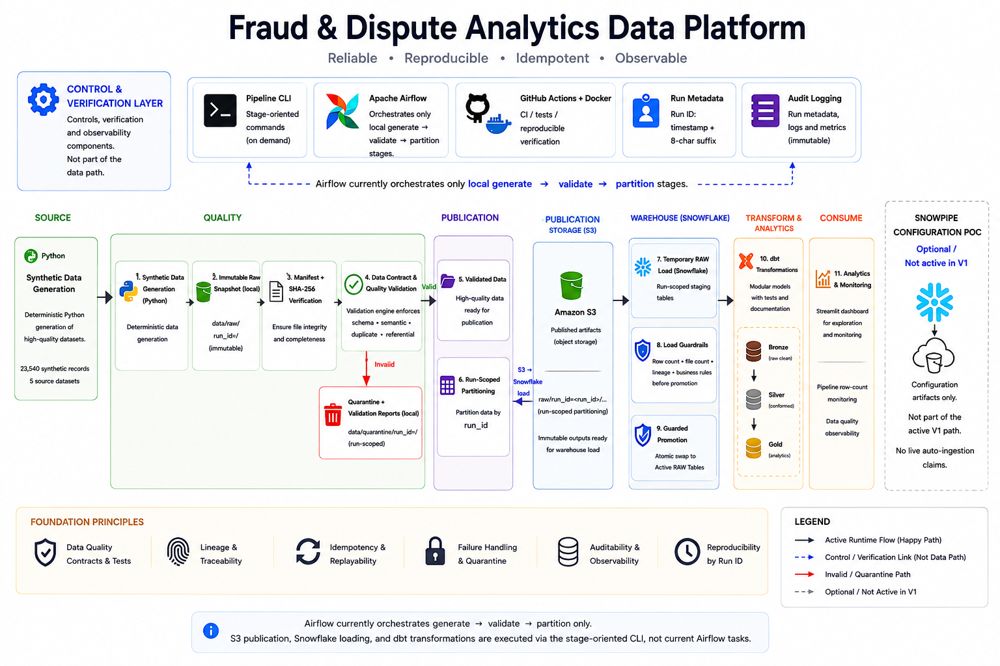
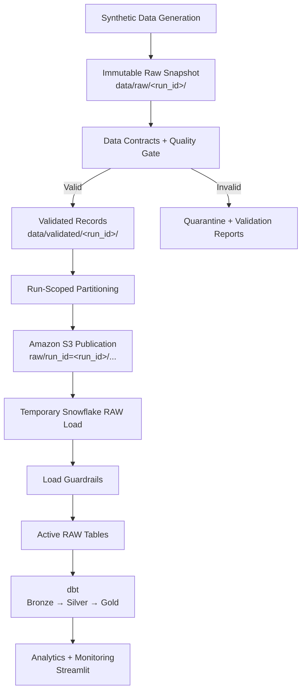

# Fraud & Dispute Analytics Data Platform

[](https://github.com/samahmedQA/fraud-dispute-analytics-pipeline/actions/workflows/ci.yml)

Production-style batch data platform for fraud, disputes, and chargebacks, designed around **reproducibility, data quality, lineage, idempotent publication, guarded warehouse loading, and recoverability** rather than simply connecting services together.

The platform generates and processes **23,540 synthetic fintech records** across **5 source datasets** governed by **5 versioned contracts**, preserves immutable run-scoped inputs, validates data before external side effects, and carries pipeline lineage into Snowflake and downstream dbt models.

**Data Platform V1 release tag:** `v1.0.0-data-platform`

> This is a portfolio project built entirely with synthetic data. It contains no company data, customer data, credentials, or secrets.

---

## At a Glance

| Metric | Data Platform V1 |
|---|---:|
| Synthetic records | **23,540** |
| Source datasets | **5** |
| Versioned JSON Schema contracts | **5** |
| pytest cases | **80** |
| dbt models | **13** |
| Gold models | **5** |
| Snowflake schemas | **4** |
| External-system execution | **Dry-run by default** |

**Technology stack:** Python · AWS S3 · Snowflake · dbt · Apache Airflow · Docker · GitHub Actions · pytest · Streamlit

The platform is intentionally batch-oriented at V1 scale. The engineering focus is reliable execution: stable inputs, explicit run identity, validation boundaries, safe replay, failure isolation, guarded publication, and auditable outcomes.

---

## Architecture

<p align="center">
  
</p>

**Execution & Controls**

- Airflow orchestrates the local `run ID -> generate -> validate -> partition` workflow.
- The stage-oriented CLI exposes S3 publication, Snowflake loading, and dbt execution.
- External mutations are dry-run by default and require explicit execution.
- GitHub Actions and Docker provide reproducible verification.

---

## Key Engineering Decisions

| Decision | Engineering rationale |
|---|---|
| **Immutable run-scoped raw snapshots** | A replay reads the same owned input batch instead of whatever files happen to exist later. |
| **Deterministic generation + manifest verification** | A seeded run can be reproduced, while row counts, file sizes, and SHA-256 hashes detect changed or incomplete input snapshots. |
| **Validation before external side effects** | Contract and integrity failures are resolved before the pipeline can mutate S3 or Snowflake. |
| **Severity-aware data quality** | Structural corruption, quarantinable relationship failures, and operational warnings produce different pipeline actions instead of one generic failure mode. |
| **Valid-parent-only referential integrity** | A child record cannot pass integrity checks merely because its referenced parent exists physically; the parent must itself be valid. |
| **Composite customer/account integrity** | The pipeline validates the `customer_id` + `account_id` relationship, preventing individually valid identifiers from forming an invalid pair. |
| **Run-scoped lineage** | `pipeline_run_id`, source file, source row number, and load metadata make warehouse records traceable back to a specific batch and source record. |
| **Idempotent S3 publication** | Completed identical run prefixes can be recognized safely; partial or conflicting prefixes are blocked unless replacement is explicit. |
| **Guarded Snowflake promotion** | Data first lands in temporary RAW tables and must satisfy row, file, run-ID, and lineage checks before active RAW data is replaced. |
| **Dry-run external execution** | S3 and Snowflake mutations require explicit execute flags, making local development and CI safe by default. |
| **Recoverable, auditable runs** | Run IDs, validation reports, quarantine outputs, step-level audit records, and failure metadata preserve enough context to diagnose and replay a batch. |

These choices are the core of the project: the platform is designed around what happens when data is wrong, a run is replayed, a publication is incomplete, or the same batch is executed again.

---

## Platform Demo

> Visual evidence is intentionally deferred to a separate README screenshot PR after this information-architecture change is reviewed.

<!-- README PR #2: Streamlit analytics screenshot -->
<!-- README PR #2: GitHub Actions CI screenshot -->
<!-- README PR #2: Snowflake batch-lineage screenshot -->
<!-- README PR #2: Airflow DAG execution screenshot -->

---

## Business Problem

A fintech data platform needs trustworthy analytics for fraud risk, dispute volume, chargeback outcomes, win/loss rates, resolution timing, and pipeline health across card networks.

This project simulates that domain and builds reliable reporting layers for:

- Fraud risk and transaction activity by card network
- Daily fraud KPIs
- Dispute and chargeback outcomes
- Chargeback win/loss rates
- Average dispute resolution time
- Pipeline and batch-level monitoring

The analytical outputs matter, but V1 is primarily an engineering project: it demonstrates how data is generated, validated, published, loaded, traced, and recovered before it becomes a dashboard metric.

---

## Data Model & Scale

The platform generates five related synthetic datasets.

| Dataset | Description | Records |
|---|---|---:|
| `customers` | Customer and account profile data | 1,500 |
| `transactions` | Card transaction activity | 10,000 |
| `fraud_signals` | Fraud scores, rules, device risk, and velocity signals | 10,000 |
| `disputes` | Customer dispute records | 1,200 |
| `chargeback_outcomes` | Chargeback outcomes, final amounts, and resolution dates | 840 |
| **Total** |  | **23,540** |

Core relationships are intentionally cross-dataset:

```text
customers
   │ customer_id + account_id
   ▼
transactions ─────────────► fraud_signals
   │ transaction_id
   ▼
disputes
   │ dispute_id
   ▼
chargeback_outcomes
```

This gives the validation layer meaningful integrity work rather than five independent files.

---

## Quick Start

### 1. Install the reproducible development environment

From the repository root:

```powershell
python -m pip install --require-hashes -r requirements-dev.lock.txt
```

The hash-locked development file is the preferred installation path for reproducing the environment used by CI. External AWS, Snowflake, and dbt execution still require local configuration and credentials.

### 2. Run the safe local pipeline

```powershell
python scripts/pipeline.py run
```

The default run performs local generation, validation, and partitioning. External S3 and Snowflake stages are not executed unless they are explicitly requested and their execute flags are supplied.

### 3. Replay an existing immutable raw snapshot

Replace the example with a real run ID already present under `data/raw/<run_id>/`:

```powershell
$runId = "20260731T190000Z_a1b2c3d4"

python scripts/pipeline.py run `
  --run-id $runId `
  --skip-generate
```

### 4. Run the automated tests

```powershell
python -m pytest tests -q
```

The repository contains **80 pytest cases** covering pipeline reliability, CLI behavior, semantic validation, referential integrity, S3 idempotency, Snowflake load guardrails, dbt lineage assertions, supported loader behavior, and documentation alignment.

For stage-by-stage commands and external-system configuration, continue into the technical deep dive below.

---

# Technical Deep Dive

## Technical Pipeline Flow


```mermaid
flowchart TD
    GEN["Synthetic Data Generation"]
    RAW["Immutable Raw Snapshot<br/>data/raw/&lt;run_id&gt;/"]
    DQ["Data Contracts + Quality Gate"]
    VALID["Validated Records<br/>data/validated/&lt;run_id&gt;/"]
    QUAR["Quarantine + Validation Reports"]
    PART["Run-Scoped Partitioning"]
    S3["Amazon S3 Publication<br/>raw/run_id=&lt;run_id&gt;/..."]
    TMP["Temporary Snowflake RAW Load"]
    GUARD["Load Guardrails"]
    RAWDB["Active RAW Tables"]
    DBT["dbt<br/>Bronze → Silver → Gold"]
    OUT["Analytics + Monitoring<br/>Streamlit"]

    GEN --> RAW
    RAW --> DQ
    DQ -->|Valid| VALID
    DQ -->|Invalid| QUAR
    VALID --> PART
    PART --> S3
    S3 --> TMP
    TMP --> GUARD
    GUARD --> RAWDB
    RAWDB --> DBT
    DBT --> OUT
```

The solid arrows represent the active V1 data path. Invalid records are routed to run-scoped quarantine and validation reports.

The current Airflow DAG ends after `partition_validated_data`; S3 publication, Snowflake loading, and dbt are not current Airflow tasks.
## Run-Scoped Data Lifecycle

Every batch is owned by a pipeline run ID with the format:

```text
YYYYMMDDTHHMMSSZ_aaaaaaaa
```

The local lifecycle is run scoped:

```text
data/raw/<run_id>/
        │
        │ raw_manifest.json + source JSONL
        ▼
contract and integrity validation
        │
        ├──────────────► data/validation_reports/<run_id>/
        ├──────────────► data/quarantine/<run_id>/invalid_records/
        │
        ▼
data/validated/<run_id>/
        │
        ▼
data/s3_partitioned/<run_id>/raw/<dataset>/year=YYYY/month=MM/
        │
        ▼
s3://<bucket>/raw/run_id=<run_id>/<dataset>/year=YYYY/month=MM/...
```

Only validated records are eligible for partitioning. A quarantined record does not silently continue downstream.

The stage-oriented CLI exposes the lifecycle directly:

```powershell
$runId = "20260731T190000Z_a1b2c3d4"

python scripts/pipeline.py validate `
  --run-id $runId

python scripts/pipeline.py partition `
  --run-id $runId
```

The end-to-end local runner also writes a run-level audit record so the final status and failed step are recoverable after execution.

---

## Data Contracts & Quality Gates

Versioned JSON Schema contracts live under:

```text
contracts/v1/
```

There are five V1 contracts:

```text
customers.schema.json
transactions.schema.json
fraud_signals.schema.json
disputes.schema.json
chargeback_outcomes.schema.json
```

Validation covers more than JSON shape. The pipeline enforces:

- Required fields and expected data types
- Enum values, identifier patterns, and numeric boundaries
- Real calendar dates and timestamps rather than regex shape alone
- Duplicate primary-key detection
- Cross-dataset referential integrity
- Composite `customer_id` / `account_id` integrity
- Validation against **schema-valid parent records**
- Severity-based hard-fail, quarantine, and warning policies

Before dataset validation begins, the validator verifies the raw snapshot manifest for the requested run. That prevents validation from unknowingly reading a missing, modified, or mismatched raw batch.

### Severity policy

| Severity | Example | Pipeline behavior |
|---|---|---|
| `hard_fail` | Missing required field, invalid type/enum, duplicate primary key | Quarantine invalid records, write reports, fail the batch, and block downstream progression |
| `quarantine_continue` | Structurally valid child references a missing or invalid parent | Quarantine invalid child records and allow valid records to continue |
| `warn_continue` | Late-arriving or unusually old transaction event | Record the warning and continue |

This keeps operational behavior proportional to the defect instead of treating every anomaly as either fatal or harmless.

### Reports and quarantine

Validation reports are written to:

```text
data/validation_reports/<run_id>/
```

Invalid records are written to:

```text
data/quarantine/<run_id>/invalid_records/
```

Validated output is written to:

```text
data/validated/<run_id>/
```

Each dataset report records items such as:

- Dataset and contract version
- Batch status and pipeline action
- Total, valid, invalid, and warning counts
- Failed rule details and severity
- Quarantine file path, when applicable
- Validated file path, when applicable

The failure policy is also documented in:

```text
docs/data_contract_failure_policy.md
```

---

## Deterministic Generation & Replay

Synthetic data generation is seeded so the same generation parameters produce a reproducible dataset. Each new raw snapshot is written beneath its owning run ID:

```text
data/raw/<run_id>/
```

The snapshot includes `raw_manifest.json`. The manifest records:

- Manifest version
- Pipeline run ID
- Deterministic seed
- Base date
- Generation timestamp
- Dataset count
- Total record count
- Per-file record count
- Per-file size
- Per-file SHA-256 hash

If a run-scoped raw directory already exists, generation does not silently replace it. The existing manifest and source files are verified against the requested run and seed before the snapshot is accepted for reuse.

This makes replay explicit:

```powershell
$runId = "20260731T190000Z_a1b2c3d4"

python scripts/pipeline.py run `
  --run-id $runId `
  --skip-generate
```

Replay therefore means “process this exact owned snapshot again,” not “regenerate approximately the same type of data.”

---

## S3 Publication & Idempotency

Validated records are partitioned locally by dataset, year, and month beneath the run-scoped partition directory:

```text
data/s3_partitioned/<run_id>/raw/
├── customers/year=YYYY/month=MM/
├── transactions/year=YYYY/month=MM/
├── fraud_signals/year=YYYY/month=MM/
├── disputes/year=YYYY/month=MM/
└── chargeback_outcomes/year=YYYY/month=MM/
```

The partition step also writes a `partition_manifest.json` describing the run and partitioned output.

Remote publication adds the run ID before the dataset path:

```text
s3://<bucket>/raw/run_id=<run_id>/...
```

The S3 publisher validates local partition output before publication and uses metadata to make reruns explicit. The publication design includes:

- Run-scoped remote prefixes
- Partition-manifest verification
- SHA-256 metadata for published files
- An inventory hash for the expected run contents
- `_SUCCESS.json` as the completion marker
- Detection of an already-complete identical run
- Detection of partial or conflicting remote prefixes
- Explicit `--allow-overwrite` semantics for intentional replacement

Preview one publication without mutating AWS:

```powershell
$runId = "20260731T190000Z_a1b2c3d4"

python scripts/pipeline.py upload-s3 `
  --run-id $runId `
  --bucket <your-bucket-name>
```

The command is a local dry run unless `--execute` is supplied. An intentional replacement additionally requires the overwrite option supported by the CLI.

The dry run validates publication preparation; it does **not** contact AWS or by itself prove live S3 integration.

---

## Snowflake Loading & Recovery

The Snowflake database is organized into four schemas:

| Schema | Purpose |
|---|---|
| `RAW` | Raw JSON landing records plus source lineage |
| `STAGING` | Bronze and silver transformation layers |
| `MARTS` | Gold analytical marts |
| `MONITORING` | Pipeline observability outputs |

The bootstrap SQL is located at:

```text
sql/snowflake_setup.sql
```

It defines the core warehouse, database, schemas, JSON file format, and five RAW landing tables.

### Run-specific guarded RAW load

The supported loader consumes a single published S3 run:

```text
raw/run_id=<run_id>/...
```

Dry run:

```powershell
$runId = "20260731T190000Z_a1b2c3d4"

python scripts/pipeline.py load-snowflake `
  --run-id $runId
```

Execute only after the target environment is configured:

```powershell
python scripts/pipeline.py load-snowflake `
  --run-id $runId `
  --execute
```

The default SQL file is:

```text
sql/load_raw_from_s3.sql
```

The loader follows a guarded promotion sequence:

```text
COPY one run into temporary RAW tables
        ↓
validate expected row counts
validate source file counts
validate pipeline_run_id
validate source_file / source_row_number lineage
        ↓
BEGIN TRANSACTION
        ↓
replace active RAW contents from validated temporary tables
        ↓
COMMIT
```

The guardrail checkpoint occurs **before** the transaction that replaces active RAW contents. If staged data does not match the local partition manifest or required lineage expectations, promotion is blocked.

RAW lineage fields include:

```text
pipeline_run_id
source_file
source_row_number
loaded_at
```

### Controlled full-reload tradeoff

V1 uses a controlled full-RAW replacement pattern because the project is small, synthetic, batch oriented, and optimized for deterministic replay. The important property is not “full reload”; it is that replacement occurs only after a run-specific staged load passes guardrails.

A materially larger append-oriented production workload would likely require different state-management and incremental-ingestion semantics. Those are production considerations, not requirements to make this V1 portfolio dataset artificially complex.

---

## dbt Transformation Layer

The dbt project contains **13 SQL models**:

```text
5 Bronze
2 Silver
5 Gold
1 Monitoring
```

### Bronze — 5 models

Bronze models flatten RAW JSON into typed relational columns while preserving source lineage.

```text
br_customers
br_transactions
br_fraud_signals
br_disputes
br_chargeback_outcomes
```

Each Bronze model carries lineage fields including `pipeline_run_id`, `source_file`, `source_row_number`, and `loaded_at`.

### Silver — 2 models

```text
silver_transactions_enriched
silver_dispute_outcomes
```

`silver_transactions_enriched` joins transactions, customers, and fraud signals at the same pipeline-run grain and adds analytical fraud attributes.

`silver_dispute_outcomes` combines disputes, enriched transaction context, and chargeback outcomes while preserving batch-aware joins and source provenance.

### Gold — 5 models

```text
gold_fraud_summary_by_network
gold_dispute_chargeback_summary_by_network
gold_daily_fraud_kpis
gold_daily_dispute_kpis
gold_pipeline_batch_metadata
```

The first four provide business-facing fraud, dispute, chargeback, and timing metrics while retaining `pipeline_run_id` in their aggregation grain. `gold_pipeline_batch_metadata` summarizes batch-level dataset metadata across all five Bronze datasets.

### Monitoring — 1 model

```text
monitoring_pipeline_row_counts
```

The monitoring model provides a lightweight row-count view across core warehouse layers.

### dbt tests and execution claim

The project includes dbt schema tests and custom lineage tests, including assertions for Bronze, Silver, and Gold batch lineage. The repository also includes pytest assertions that inspect the dbt model SQL for expected lineage behavior.

A **current successful live `dbt build` is not claimed in this README** because execution depends on a configured Snowflake target and no current build artifact is being used as evidence for this PR.

A safe profile template is provided at:

```text
dbt/fraud_dispute_dbt/profiles.yml.example
```

The real dbt profile belongs outside the repository, normally at:

```text
~/.dbt/profiles.yml
```

---

## Airflow Orchestration

The local Airflow DAG is defined at:

```text
airflow/dags/fraud_dispute_pipeline_dag.py
```

Its current task graph is exactly:

```text
create_pipeline_run_id
→ generate_synthetic_data
→ validate_data_contracts
→ partition_validated_data
```

Airflow creates one run ID and passes that identifier through the local stages. Dataset files remain in the shared Docker volume rather than being pushed through XCom; XCom carries only the run ID.

**S3 publication, Snowflake loading, and dbt execution are not currently Airflow tasks.** Those capabilities are exposed by the stage-oriented CLI and are intentionally outside the current DAG.

The local Compose environment includes PostgreSQL metadata storage, a scheduler, API server, DAG processor, retries, task execution timeouts, and a one-active-run DAG constraint. It is a local orchestration demonstration, not a production Airflow deployment.

Airflow-specific setup and security limitations are documented in:

```text
airflow/README.md
```

---

## CI/CD and Docker

GitHub Actions is configured in:

```text
.github/workflows/ci.yml
```

The workflow has two jobs.

### Python checks

The Python job is configured to:

```text
checkout
→ set up the repository Python version
→ install requirements-dev.lock.txt with --require-hashes
→ compile Python files
→ compile the Airflow DAG
→ run the full pytest suite
→ create a run ID
→ generate synthetic data
→ validate data contracts
→ partition validated data
```

CI deliberately stops before external mutations:

```text
No real S3 upload
No Snowflake reload execution
No cloud credentials required
```

### Docker checks

The Docker job is configured to:

```text
build the test target
→ run containerized tests
→ build the runtime target
→ verify the runtime CLI
→ verify the runtime runs as non-root UID 10001
```

The root `Dockerfile` is multi-stage and uses the hash-locked dependency files. The runtime image is separated from the test image so test-only dependencies do not define the production-style runtime surface.

This README describes what CI is configured to verify; the live GitHub Actions badge above is the appropriate source for current workflow status.

---

## Reliability & Observability

Reliability signals are produced at multiple stages rather than only at the dashboard layer.

### Validation audit log

Each validation run writes:

```text
data/validation_reports/<run_id>/validation_audit_log.jsonl
```

Records include:

- Validation timestamp
- Dataset and contract version
- Batch status and pipeline action
- Total, valid, invalid, and warning counts
- Error counts by severity
- Report, quarantine, and validated-output paths

### Pipeline audit log

The local end-to-end runner writes run-level audit artifacts under:

```text
data/pipeline_audit_logs/
```

A pipeline audit record includes:

- Pipeline run ID
- Start and end timestamps
- Runtime duration
- Final pipeline status
- Failed step and failure reason, when applicable
- Command and step-level execution records
- Validation summary
- S3, Snowflake, and dbt execution mode when those stages are requested

A sanitized example is stored under:

```text
docs/sample_outputs/
```

### Warehouse lineage and monitoring

Lineage is preserved from RAW into dbt rather than being discarded after ingestion. The core lineage fields are:

```text
pipeline_run_id
source_file
source_row_number
loaded_at
```

The Gold layer also includes:

```text
gold_pipeline_batch_metadata
```

and the monitoring layer includes:

```text
monitoring_pipeline_row_counts
```

Together, these provide batch identity, source provenance, and lightweight row-count visibility for downstream inspection.

---

## Snowpipe POC

The repository includes Snowpipe SQL/configuration artifacts that illustrate an event-driven auto-ingest design. It is intentionally classified as a **configuration proof of concept**.

Intended pattern:

```text
S3 object-created event
→ Snowflake notification channel
→ Snowpipe COPY INTO
→ test RAW table
```

Relevant test objects include:

| Object | Purpose |
|---|---|
| `RAW_TRANSACTIONS_PIPE_TEST` | Test landing table |
| `PIPE_TRANSACTIONS_SNOWPIPE_TEST` | Pipe configured with `AUTO_INGEST = TRUE` |
| `raw/snowpipe_test/transactions/` | Dedicated test prefix |

The repository demonstrates the configuration pattern. **It does not claim independently verified live S3 event delivery or production Snowpipe auto-ingestion.**

---

## Streamlit Analytics

The dashboard is located at:

```text
dashboards/streamlit_app.py
```

It is designed to expose analytical outputs from the Gold and monitoring layers, including:

- Fraud KPIs by card network
- Daily fraud trends
- Dispute and chargeback KPIs
- Chargeback win/loss outcomes
- Pipeline row-count monitoring

Snowflake configuration is environment driven, including `SNOWFLAKE_DATABASE`, so the dashboard code does not need SQL edits to point at a different configured database.

Run locally after Snowflake is configured:

```powershell
streamlit run dashboards\streamlit_app.py
```

---

## Implemented vs POC

The project intentionally distinguishes repository implementation from live external execution and production operation.

| Capability | V1 status |
|---|---|
| Deterministic synthetic generation | **Implemented + tested** |
| Immutable raw snapshots and raw-manifest verification | **Implemented + tested** |
| Five versioned data contracts | **Implemented + tested** |
| Semantic validation, duplicate detection, referential/composite integrity | **Implemented + tested** |
| Severity-aware quarantine and failure handling | **Implemented + tested** |
| Run-scoped validated output and partitioning | **Implemented + tested** |
| Idempotent S3 publisher and completion-marker behavior | **Implemented + tested behavior; live mutation is opt-in** |
| Guarded Snowflake loader | **Implemented + guardrail-tested; live execution requires a configured target** |
| 13 dbt model definitions and dbt tests | **Implemented** |
| Current successful live dbt build | **Not claimed** |
| Four-task Airflow local DAG | **Implemented for run ID → generate → validate → partition** |
| Airflow orchestration of S3 → Snowflake → dbt | **Not implemented** |
| GitHub Actions and Docker verification configuration | **Implemented** |
| Snowpipe auto-ingest | **Configuration POC; live auto-ingestion not claimed** |
| Production Airflow/cloud deployment | **Not claimed** |
| Grounded AI investigation layer | **Not implemented; next phase** |

This distinction is deliberate: having code for an integration, testing its behavior, executing against a configured external environment, and operating that integration in production are different claims.

---

## Repository Structure

```text
.
├── .github/
│   └── workflows/ci.yml
├── airflow/
│   ├── dags/fraud_dispute_pipeline_dag.py
│   ├── docker-compose.yml
│   └── README.md
├── contracts/
│   └── v1/
├── dashboards/
│   └── streamlit_app.py
├── dbt/
│   └── fraud_dispute_dbt/
│       ├── models/
│       │   ├── bronze/
│       │   ├── silver/
│       │   ├── gold/
│       │   └── monitoring/
│       └── tests/
├── docs/
│   ├── data_contract_failure_policy.md
│   └── sample_outputs/
├── scripts/
│   ├── generate_data.py
│   ├── pipeline.py
│   ├── run_pipeline.py
│   ├── run_snowflake_sql.py
│   ├── upload_partitioned_to_s3.py
│   ├── validate_data_contracts.py
│   └── partition_data_for_s3.py
├── sql/
│   ├── snowflake_setup.sql
│   ├── setup_s3_stage_template.sql
│   ├── load_raw_from_s3.sql
│   ├── validate_raw_counts.sql
│   ├── setup_snowflake_role_template.sql
│   └── setup_snowpipe_template.sql
├── tests/
├── Dockerfile
├── requirements.lock.txt
└── requirements-dev.lock.txt
```

Key reusable Snowflake scripts:

| Script | Purpose |
|---|---|
| `sql/snowflake_setup.sql` | Creates core Snowflake objects and RAW landing tables |
| `sql/setup_s3_stage_template.sql` | Template for storage integration and S3 external stage setup |
| `sql/load_raw_from_s3.sql` | Run-scoped guarded RAW loading and promotion |
| `sql/validate_raw_counts.sql` | RAW row-count validation queries |
| `sql/setup_snowflake_role_template.sql` | Role/grant setup template |
| `sql/setup_snowpipe_template.sql` | Snowpipe configuration POC |

---

## Production Considerations

V1 is intentionally sized as a portfolio platform, so “production hardening” is treated as a set of architectural questions rather than a shopping list of additional tools.

At materially larger scale or under production operational requirements, the design would need decisions around:

- **Infrastructure lifecycle:** repeatable provisioning, environment isolation, ownership, and change control for cloud and warehouse resources
- **Secrets and identity:** managed credentials, least-privilege roles, key rotation, and workload identity
- **Ingestion state:** append/incremental semantics, file-level load state, late-arriving data, replay boundaries, and deduplication across batches
- **Warehouse promotion:** stronger deployment and rollback patterns for concurrent or continuously arriving workloads
- **Transformation strategy:** incremental model behavior where full rebuilds are no longer appropriate
- **Observability:** freshness, volume, quality, and run-failure alerting with operational ownership and escalation paths
- **Orchestration:** managed deployment, durable scheduling, backfills, notifications, concurrency controls, and service-level expectations
- **Access control:** environment-specific Snowflake roles and separation of operational duties

The current controlled full-reload design does not need to be replaced merely to add complexity. It is appropriate to the V1 workload because it is guarded, run scoped, replayable, and explicit about its tradeoffs.

---

## Next Phase: Grounded AI Investigation

The next project phase is a grounded fraud/dispute investigation layer built **on top of** the completed data-platform foundation. The goal is to answer investigation questions using structured platform data and curated supporting documents while preserving source attribution and evaluation boundaries.

That AI layer is **not part of Data Platform V1 and is not implemented or claimed here**.

---

## Disclaimer

This repository is a portfolio project using fully synthetic fraud, dispute, chargeback, customer, and transaction data.

It does not contain proprietary company data, real customer data, production credentials, secrets, or a claim of production operation. External-system execution requires explicit configuration and is dry-run by default where supported by the pipeline CLI.
