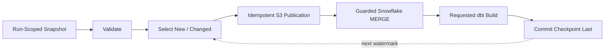
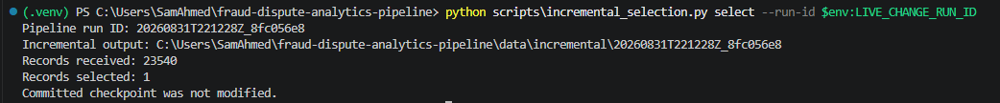
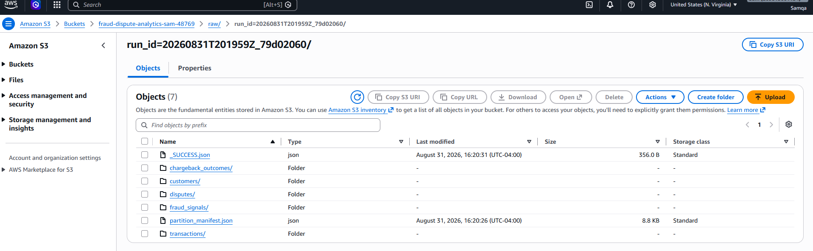
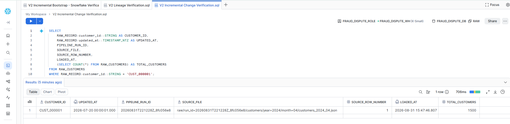
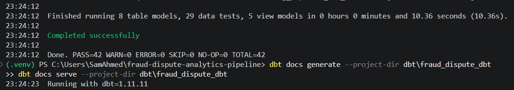
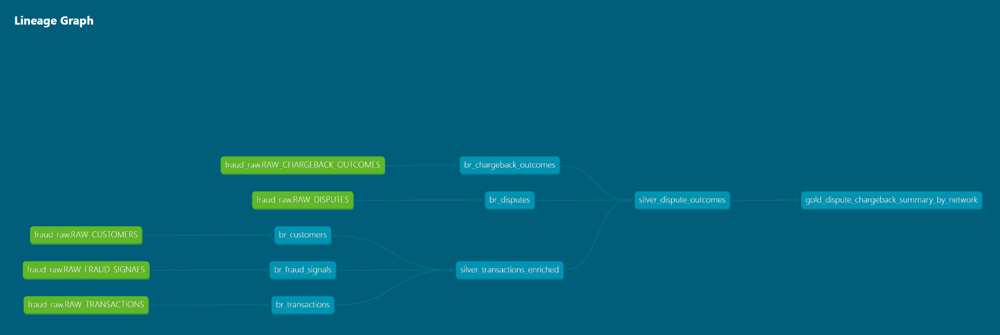
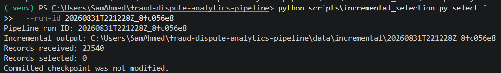
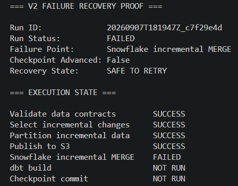
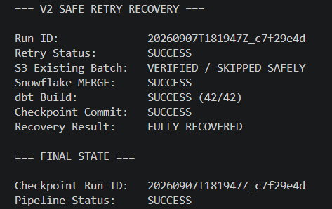
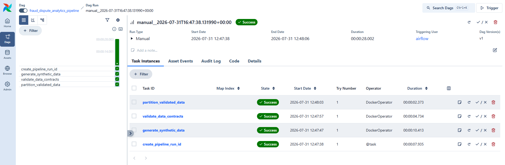

# Fraud & Dispute Analytics Data Platform

[](https://github.com/samahmedQA/fraud-dispute-analytics-pipeline/actions/workflows/ci.yml)

A production-style incremental data platform for fraud and dispute analytics, built with Python, AWS S3, Snowflake, dbt, and Airflow.

The platform uses versioned data contracts, stateful incremental selection, idempotent S3 publication, guarded Snowflake `MERGE` operations, dbt transformations, end-to-end lineage, audit logging, and failure-safe checkpointing.

**Current release:** `v2.0.0-incremental-platform` | **V1:** `v1.0.0-data-platform`

> This is an independent portfolio/reference implementation built entirely with synthetic data. It contains no employer, customer, or production data, credentials, or secrets.

---

## V2 Architecture


```mermaid
flowchart LR
    A[Run-Scoped Snapshot] --> B[Validate]
    B --> C[Select New / Changed]
    C --> D[Idempotent S3 Publication]
    D --> E[Guarded Snowflake MERGE]
    E --> F[Requested dbt Build]
    F --> G[Commit Checkpoint Last]
    G -. next watermark .-> C
```

V2 processes only new or changed records and supports zero-change batches. Committed ingestion state advances only after required downstream stages succeed, allowing failed runs to retry safely.

---

## Reliability Design

- **Stateful incremental processing** — per-dataset watermarks identify only new or changed records instead of reprocessing the full dataset.
- **Boundary-safe checkpoints** — watermark state tracks records already seen at the current timestamp boundary so equal-timestamp records are not lost.
- **Idempotent publication** — completed S3 batches can be safely recognized and replayed without creating duplicate output.
- **Guarded Snowflake MERGE** — incoming data is validated in temporary RAW tables before transactional inserts or updates reach persistent tables.
- **Failure-safe state management** — candidate checkpoints are committed only after requested downstream stages succeed, preserving safe retry behavior.
- **End-to-end lineage and auditability** — run IDs, source metadata, validation reports, warehouse lineage, and step-level audit records make each batch traceable.

The design focuses on operational correctness: what happens when data changes, a run is replayed, downstream work fails, or the same batch is executed again.

---

## At a Glance

| Area | Current platform |
|---|---|
| **Data** | 23,540 synthetic records across 5 related datasets |
| **Contracts** | 10 versioned JSON Schema contracts across V1 and V2 |
| **Incremental state** | Per-dataset watermarks with boundary-safe primary-key state |
| **Storage** | Live AWS S3 with immutable, run-scoped, idempotent publication |
| **Warehouse** | Live Snowflake RAW layer with guarded transactional `MERGE` |
| **Transformation** | 13 dbt models across Bronze, Silver, Gold, and Monitoring |
| **dbt verification** | 42/42 successful build resources |
| **Automated testing** | 140 pytest cases |
| **Orchestration** | Airflow for local pipeline stages; Python orchestrator for the full V2 cloud lifecycle |
| **CI** | GitHub Actions |

**Technology stack:** Python · AWS S3 · Snowflake · dbt · Apache Airflow · Docker · GitHub Actions · pytest · Streamlit

V2 has been exercised against live AWS S3, Snowflake, and dbt infrastructure while preserving safe local and CI defaults.

---

## Business Problem

A fintech data platform needs trustworthy analytics for fraud risk, dispute volume, chargeback outcomes, win/loss rates, resolution timing, and pipeline health across card networks.

This project simulates that domain and builds reliable reporting layers for:

- Fraud risk and transaction activity by card network
- Daily fraud KPIs
- Dispute and chargeback outcomes
- Chargeback win/loss rates
- Average dispute resolution time
- Pipeline and batch-level monitoring

The analytical outputs matter, but this is primarily an engineering project: it demonstrates how data is generated, validated, published, loaded, traced, and recovered before it becomes a dashboard metric.

---

## Data Model & Scale

The platform generates five related synthetic datasets.

| Dataset | Description | Records |
|---|---|---:|
| `customers` | Customer and account profile data | 1,500 |
| `transactions` | Card transaction activity | 10,000 |
| `fraud_signals` | Fraud scores, rules, device risk, and velocity signals | 10,000 |
| `disputes` | Customer dispute records | 1,200 |
| `chargeback_outcomes` | Chargeback outcomes, final amounts, and resolution dates | 840 |
| **Total** |  | **23,540** |

Core relationships are intentionally cross-dataset:

```text
customers
   │ customer_id + account_id
   ▼
transactions ─────────────► fraud_signals
   │ transaction_id
   ▼
disputes
   │ dispute_id
   ▼
chargeback_outcomes
```

This gives the validation layer meaningful integrity work rather than five independent files.

---

## Incremental Processing

V2 compares each validated source record against the last committed per-dataset checkpoint and selects only records that are new or changed.

The checkpoint stores both the latest `updated_at` watermark and the primary keys already processed at that timestamp boundary. This prevents records with equal timestamps from being skipped.

**Incremental behavior verified:**

- Baseline load: **23,540 received → 23,540 selected**
- One customer changed: **23,540 received → 1 selected**
- Identical replay after commit: **23,540 received → 0 selected**
- Zero-change batches continue safely without unnecessary warehouse updates

> **Live proof:** a controlled update to one customer selected exactly one record while leaving the committed checkpoint unchanged until downstream execution completed.



---

## Live S3 + Snowflake Execution

V2 has been executed against live AWS S3 and Snowflake infrastructure, not only simulated through local dry runs.

### Idempotent S3 Publication

Validated incremental output is published beneath a run-scoped S3 prefix. The publisher verifies the partition manifest and expected inventory, writes the completion marker last, and safely recognizes an already-complete identical batch.



### Guarded Incremental Snowflake MERGE

Sparse changes first land in temporary RAW tables and pass manifest, lineage, primary-key, duplicate-key, and `updated_at` guardrails before the transactional `MERGE` can modify persistent RAW data.

In the controlled one-record test, the changed customer was updated in place while the customer table remained at **1,500 rows**, confirming update behavior without duplicate insertion.



---

## dbt Transformation & Testing

Snowflake RAW data is transformed through **13 dbt models** across Bronze, Silver, Gold, and Monitoring layers.

- **5 Bronze models** flatten RAW JSON into typed relational data while preserving lineage
- **2 Silver models** join fraud, transaction, dispute, and chargeback context
- **5 Gold models** produce business-facing fraud and dispute analytics
- **1 Monitoring model** tracks pipeline row counts across warehouse layers

A live V2 dbt build completed successfully against the configured Snowflake target.



The model lineage keeps the analytical path visible from RAW through Bronze, Silver, and Gold.



---

## Idempotency & Replay

The pipeline is designed so the same committed source state can be replayed without producing duplicate incremental work.

After the one-record change was successfully processed and its checkpoint committed, replaying the same source snapshot selected **0 records**. This confirms that the committed watermark and boundary-key state prevent already-processed records from being selected again.



---

## Failure Recovery

V2 treats checkpoint state as part of the transaction boundary. A candidate checkpoint is created during incremental selection but is not committed until every requested downstream stage succeeds.

In a controlled failure test, S3 publication succeeded but the Snowflake incremental `MERGE` failed. dbt and checkpoint commit were not executed, and the previous committed watermark remained unchanged.



The exact same run was then retried after the downstream issue was corrected. The existing S3 batch was verified and skipped safely, Snowflake completed successfully, dbt passed **42/42**, and the checkpoint committed only after recovery completed.



This preserves replay safety without manually advancing state or rebuilding the run under a new identifier.

---

## Orchestration

Airflow orchestrates the local preparation stages while the recovery-aware Python V2 orchestrator controls the cloud execution lifecycle.

**Current Airflow DAG:**

`create_pipeline_run_id → generate_synthetic_data → validate_data_contracts → partition_validated_data`

Airflow passes a single run ID across tasks while dataset files remain in the shared volume rather than moving through XCom.

**Full V2 lifecycle:** S3 publication → Snowflake `MERGE` → requested dbt build → checkpoint commit.

Keeping that boundary explicit avoids implying that the current Airflow DAG orchestrates cloud stages it does not yet own.



---

## Quick Start

### 1. Install the reproducible development environment

From the repository root:

```powershell
python -m pip install --require-hashes -r requirements-dev.lock.txt
```

The hash-locked development file is the preferred installation path for reproducing the environment used by CI. External AWS, Snowflake, and dbt execution still require local configuration and credentials.

### 2. Run the safe local pipeline

```powershell
python scripts/pipeline.py run
```

The default run performs local generation, validation, and partitioning. External S3 and Snowflake stages are not executed unless they are explicitly requested and their execute flags are supplied.

### 3. Preview the V2 incremental path

```powershell
python scripts/pipeline.py run --mode incremental
```

This runs V2 locally in safe mode. Candidate state stays uncommitted unless required downstream execution succeeds.

### 4. Replay an existing immutable raw snapshot

Replace the example with a real run ID already present under `data/raw/<run_id>/`:

```powershell
$runId = "20260731T190000Z_a1b2c3d4"

python scripts/pipeline.py run `
  --run-id $runId `
  --skip-generate
```

### 5. Run the automated tests

```powershell
python -m pytest tests -q
```

The automated suite covers pipeline reliability, incremental state and recovery, data quality, S3 idempotency, Snowflake loading and `MERGE` behavior, lineage, CLI behavior, and documentation alignment.

For stage-by-stage commands and external-system configuration, continue into the technical deep dive below.

---

## Technical Deep Dive

Detailed implementation notes, stage-by-stage commands, Snowflake setup, contracts, validation logic, S3 publication mechanics, dbt internals, Airflow configuration, CI/CD, and repository structure are documented separately.

[Read the technical deep dive](docs/technical-deep-dive.md)

---

## Disclaimer

This repository is a portfolio project using fully synthetic fraud, dispute, chargeback, customer, and transaction data.

It does not contain proprietary company data, real customer data, production credentials, secrets, or a claim of production operation. External-system execution requires explicit configuration and is dry-run by default where supported by the pipeline CLI.
