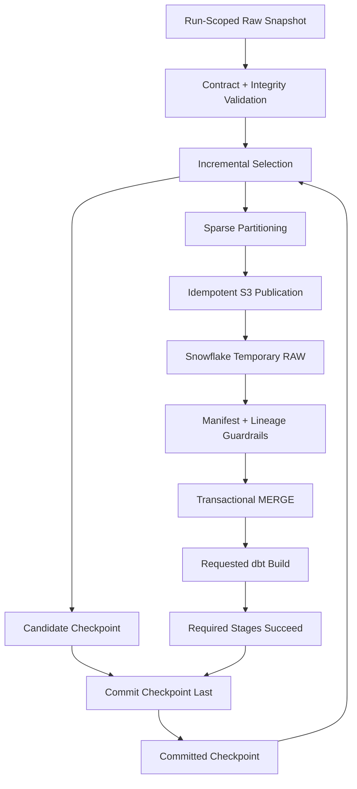

# Fraud & Dispute Analytics Data Platform

[](https://github.com/samahmedQA/fraud-dispute-analytics-pipeline/actions/workflows/ci.yml)

A production-style incremental data platform for fraud and dispute analytics, built with Python, AWS S3, Snowflake, dbt, and Airflow.

The platform processes **23,540 synthetic fintech records** across **5 related datasets** using versioned data contracts, stateful incremental selection, idempotent S3 publication, guarded Snowflake `MERGE` operations, dbt transformations, end-to-end lineage, audit logging, and failure-safe checkpointing.

**Current release:** `v2.0.0-incremental-platform` | **V1:** `v1.0.0-data-platform`

> This is an independent portfolio/reference implementation built entirely with synthetic data. It contains no employer, customer, or production data, credentials, or secrets.

---

## V2 Architecture


```mermaid
flowchart TD
    A[Run-Scoped Raw Snapshot] --> B[Contract + Integrity Validation]
    B --> C[Incremental Selection]
    J[Committed Checkpoint] --> C
    C --> D[Sparse Partitioning]
    C --> K[Candidate Checkpoint]
    D --> E[Idempotent S3 Publication]
    E --> F[Snowflake Temporary RAW]
    F --> G[Manifest + Lineage Guardrails]
    G --> H[Transactional MERGE]
    H --> I[Requested dbt Build]
    I --> L[Required Stages Succeed]
    K --> M[Commit Checkpoint Last]
    L --> M
    M --> J
```

V2 processes only new or changed records and supports zero-change batches. Committed ingestion state advances only after required downstream stages succeed, allowing failed runs to retry safely.

---

## What Makes It Production-Style

- **Stateful incremental processing** — per-dataset watermarks identify only new or changed records instead of reprocessing the full dataset.
- **Boundary-safe checkpoints** — watermark state tracks records already seen at the current timestamp boundary so equal-timestamp records are not lost.
- **Idempotent publication** — completed S3 batches can be safely recognized and replayed without creating duplicate output.
- **Guarded Snowflake MERGE** — incoming data is validated in temporary RAW tables before transactional inserts or updates reach persistent tables.
- **Failure-safe state management** — candidate checkpoints are committed only after requested downstream stages succeed, preserving safe retry behavior.
- **End-to-end lineage and auditability** — run IDs, source metadata, validation reports, warehouse lineage, and step-level audit records make each batch traceable.

The design focuses on operational correctness: what happens when data changes, a run is replayed, downstream work fails, or the same batch is executed again.

---

## At a Glance

| Area | Current platform |
|---|---|
| **Data** | 23,540 synthetic records across 5 related datasets |
| **Contracts** | 10 versioned JSON Schema contracts across V1 and V2 |
| **Incremental state** | Per-dataset watermarks with boundary-safe primary-key state |
| **Storage** | Live AWS S3 with immutable, run-scoped, idempotent publication |
| **Warehouse** | Live Snowflake RAW layer with guarded transactional `MERGE` |
| **Transformation** | 13 dbt models across Bronze, Silver, Gold, and Monitoring |
| **dbt verification** | 42/42 successful build resources |
| **Automated testing** | 140 pytest cases |
| **Orchestration** | Airflow for local pipeline stages; Python orchestrator for the full V2 cloud lifecycle |
| **CI** | GitHub Actions |

**Technology stack:** Python · AWS S3 · Snowflake · dbt · Apache Airflow · Docker · GitHub Actions · pytest · Streamlit

V2 has been exercised against live AWS S3, Snowflake, and dbt infrastructure while preserving safe local and CI defaults.

---

## Business Problem

A fintech data platform needs trustworthy analytics for fraud risk, dispute volume, chargeback outcomes, win/loss rates, resolution timing, and pipeline health across card networks.

This project simulates that domain and builds reliable reporting layers for:

- Fraud risk and transaction activity by card network
- Daily fraud KPIs
- Dispute and chargeback outcomes
- Chargeback win/loss rates
- Average dispute resolution time
- Pipeline and batch-level monitoring

The analytical outputs matter, but this is primarily an engineering project: it demonstrates how data is generated, validated, published, loaded, traced, and recovered before it becomes a dashboard metric.

---

## Data Model & Scale

The platform generates five related synthetic datasets.

| Dataset | Description | Records |
|---|---|---:|
| `customers` | Customer and account profile data | 1,500 |
| `transactions` | Card transaction activity | 10,000 |
| `fraud_signals` | Fraud scores, rules, device risk, and velocity signals | 10,000 |
| `disputes` | Customer dispute records | 1,200 |
| `chargeback_outcomes` | Chargeback outcomes, final amounts, and resolution dates | 840 |
| **Total** |  | **23,540** |

Core relationships are intentionally cross-dataset:

```text
customers
   │ customer_id + account_id
   ▼
transactions ─────────────► fraud_signals
   │ transaction_id
   ▼
disputes
   │ dispute_id
   ▼
chargeback_outcomes
```

This gives the validation layer meaningful integrity work rather than five independent files.

---

## Incremental Processing

V2 compares each validated source record against the last committed per-dataset checkpoint and selects only records that are new or changed.

The checkpoint stores both the latest `updated_at` watermark and the primary keys already processed at that timestamp boundary. This prevents records with equal timestamps from being skipped.

**Incremental behavior verified:**

- Baseline load: **23,540 received → 23,540 selected**
- One customer changed: **23,540 received → 1 selected**
- Identical replay after commit: **23,540 received → 0 selected**
- Zero-change batches continue safely without unnecessary warehouse updates

> **Live proof:** a controlled update to one customer selected exactly one record while leaving the committed checkpoint unchanged until downstream execution completed.


---

## Live S3 + Snowflake Execution

V2 has been executed against live AWS S3 and Snowflake infrastructure, not only simulated through local dry runs.

### Idempotent S3 Publication

Validated incremental output is published beneath a run-scoped S3 prefix. The publisher verifies the partition manifest and expected inventory, writes the completion marker last, and safely recognizes an already-complete identical batch.


### Guarded Incremental Snowflake MERGE

Sparse changes first land in temporary RAW tables and pass manifest, lineage, primary-key, duplicate-key, and `updated_at` guardrails before the transactional `MERGE` can modify persistent RAW data.

In the controlled one-record test, the changed customer was updated in place while the customer table remained at **1,500 rows**, confirming update behavior without duplicate insertion.


---

## dbt Transformation & Testing

Snowflake RAW data is transformed through **13 dbt models** across Bronze, Silver, Gold, and Monitoring layers.

- **5 Bronze models** flatten RAW JSON into typed relational data while preserving lineage
- **2 Silver models** join fraud, transaction, dispute, and chargeback context
- **5 Gold models** produce business-facing fraud and dispute analytics
- **1 Monitoring model** tracks pipeline row counts across warehouse layers

The live V2 build completed successfully with **42/42 resources passed, 0 warnings, 0 errors, and 0 skips**.


The model lineage keeps the analytical path visible from RAW through Bronze, Silver, and Gold.


---

## Idempotency & Replay

The pipeline is designed so the same committed source state can be replayed without producing duplicate incremental work.

After the one-record change was successfully processed and its checkpoint committed, replaying the same source snapshot selected **0 records**. This confirms that the committed watermark and boundary-key state prevent already-processed records from being selected again.


---

## Failure Recovery

V2 treats checkpoint state as part of the transaction boundary. A candidate checkpoint is created during incremental selection but is not committed until every requested downstream stage succeeds.

In a controlled failure test, S3 publication succeeded but the Snowflake incremental `MERGE` failed. dbt and checkpoint commit were not executed, and the previous committed watermark remained unchanged.


The exact same run was then retried after the downstream issue was corrected. The existing S3 batch was verified and skipped safely, Snowflake completed successfully, dbt passed **42/42**, and the checkpoint committed only after recovery completed.


This preserves replay safety without manually advancing state or rebuilding the run under a new identifier.

---

## Orchestration

Airflow orchestrates the local preparation stages while the recovery-aware Python V2 orchestrator controls the cloud execution lifecycle.

**Current Airflow DAG:**

`create_pipeline_run_id → generate_synthetic_data → validate_data_contracts → partition_validated_data`

Airflow passes a single run ID across tasks while dataset files remain in the shared volume rather than moving through XCom.

**Full V2 lifecycle:** S3 publication → Snowflake `MERGE` → requested dbt build → checkpoint commit.

Keeping that boundary explicit avoids implying that the current Airflow DAG orchestrates cloud stages it does not yet own.


---

## Quick Start

### 1. Install the reproducible development environment

From the repository root:

```powershell
python -m pip install --require-hashes -r requirements-dev.lock.txt
```

The hash-locked development file is the preferred installation path for reproducing the environment used by CI. External AWS, Snowflake, and dbt execution still require local configuration and credentials.

### 2. Run the safe local pipeline

```powershell
python scripts/pipeline.py run
```

The default run performs local generation, validation, and partitioning. External S3 and Snowflake stages are not executed unless they are explicitly requested and their execute flags are supplied.

### 3. Preview the V2 incremental path

```powershell
python scripts/pipeline.py run --mode incremental
```

This runs V2 locally in safe mode. Candidate state stays uncommitted unless required downstream execution succeeds.

### 4. Replay an existing immutable raw snapshot

Replace the example with a real run ID already present under `data/raw/<run_id>/`:

```powershell
$runId = "20260731T190000Z_a1b2c3d4"

python scripts/pipeline.py run `
  --run-id $runId `
  --skip-generate
```

### 5. Run the automated tests

```powershell
python -m pytest tests -q
```

The repository contains **140 pytest cases** covering pipeline reliability, CLI behavior, semantic validation, source change tracking, incremental selection and checkpoint recovery, sparse incremental publication and zero-change batch handling, V1/V2 contract compatibility, referential integrity, S3 idempotency, guarded Snowflake full loading, incremental `MERGE` behavior, sparse and zero-change warehouse manifests, dbt lineage assertions, supported loader behavior, and documentation alignment.

For stage-by-stage commands and external-system configuration, continue into the technical deep dive below.

---

## Testing & CI

The repository includes **140 pytest cases** covering the reliability behavior of the platform, not only individual helper functions.

Coverage includes incremental selection, checkpoint recovery, zero-change batches, S3 idempotency, guarded Snowflake loading, incremental `MERGE` behavior, lineage assertions, data-quality rules, V1/V2 compatibility, CLI behavior, and documentation alignment.

GitHub Actions runs the automated validation workflow on repository changes, providing a repeatable CI gate for the project.

**Current verification:**

- **140 pytest cases passing**
- **dbt build: 42/42 successful resources**
- **GitHub Actions CI passing on `main`**

---

## Operational Hardening

Live execution exposed several edge cases that were converted into permanent fixes and regression tests.

- **Zero-row Snowflake guardrails** — `COUNT_IF` returned `NULL` for empty incremental tables. Guardrail queries now normalize empty results to zero so valid zero-change batches complete safely.
- **Windows snapshot finalization** — atomic directory promotion occasionally encountered transient filesystem contention. Snapshot finalization now uses bounded retry behavior without silently replacing an existing destination.
- **Same-run S3 recovery** — rebuilding a partition manifest regenerated its timestamp and changed the manifest hash even when the data was identical. Same-run rebuilds now preserve stable manifest metadata so completed S3 batches can be verified and safely reused during recovery.

Each issue was reproduced, fixed, covered by regression tests, and revalidated through the affected execution path.

---

## Clone & Adapt

The repository is designed as a reusable reference implementation rather than a deployment tied to one AWS account, Snowflake account, or synthetic dataset.

To adapt the platform for another environment:

1. Bootstrap the core Snowflake objects with `sql/snowflake_setup.sql`.
2. Configure the S3 integration and stage from `sql/setup_s3_stage_template.sql`.
3. Configure the least-privilege Snowflake role from `sql/setup_snowflake_role_template.sql`.
4. Run `sql/migrate_v2_lineage_columns.sql` only when upgrading a pre-V2 installation.
5. Replace the synthetic sources, contracts, and dbt models while retaining the reliability framework.

The reusable pieces include data contracts, incremental checkpoints, idempotent publication, guarded warehouse loading, lineage, audit logging, testing, and failure-safe recovery.

---

## Production Considerations

This project is intentionally sized as a portfolio platform, so production hardening is treated as a set of architectural questions rather than a shopping list of additional tools.

At materially larger scale or under production operational requirements, the design would need decisions around:

- **Infrastructure lifecycle:** repeatable provisioning, environment isolation, ownership, and change control for cloud and warehouse resources
- **Secrets and identity:** managed credentials, least-privilege roles, key rotation, and workload identity
- **Ingestion state:** append/incremental semantics, file-level load state, late-arriving data, replay boundaries, and deduplication across batches
- **Warehouse promotion:** stronger deployment and rollback patterns for concurrent or continuously arriving workloads
- **Transformation strategy:** incremental model behavior where full rebuilds are no longer appropriate
- **Observability:** freshness, volume, quality, and run-failure alerting with operational ownership and escalation paths
- **Orchestration:** managed deployment, durable scheduling, backfills, notifications, concurrency controls, and service-level expectations
- **Access control:** environment-specific Snowflake roles and separation of operational duties

The guarded V1 full-reload path remains available for backward-compatible replay, while V2 is the primary stateful incremental path. Each approach is explicit about its tradeoffs and failure semantics.

---

## Technical Deep Dive

Detailed implementation notes, stage-by-stage commands, Snowflake setup, contracts, validation logic, S3 publication mechanics, dbt internals, Airflow configuration, CI/CD, and repository structure are documented separately.

[Read the technical deep dive](docs/technical-deep-dive.md)

---

## Disclaimer

This repository is a portfolio project using fully synthetic fraud, dispute, chargeback, customer, and transaction data.

It does not contain proprietary company data, real customer data, production credentials, secrets, or a claim of production operation. External-system execution requires explicit configuration and is dry-run by default where supported by the pipeline CLI.
